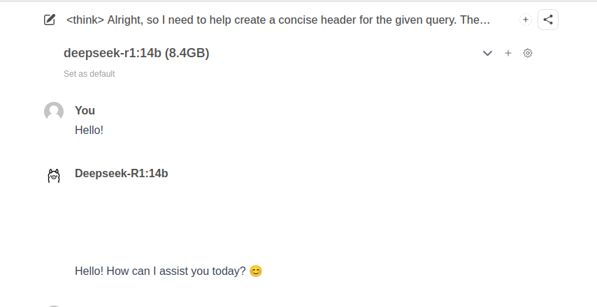

# Deepseek R1 on AWS using Terraform.

A quick terraform project to create an EC2 instance running Deepseek R1

Using the approach from this guide: https://community.aws/content/2sEuHQlpyIFSwCkzmx585JckSgN/deploying-deepseek-r1-14b-on-amazon-ec2

## Prerequisites

To use this project, ensure you have the following installed locally:

* Terraform (version 1.0 or higher recommended)
* An AWS account with permissions to create EC2 instances, IAM roles, and VPC resources

## Getting Started

### 1. Clone the Repository

```
git clone https://github.com/gordonmurray/terraform_aws_deepseek.git
cd terraform_aws_deepseek
```

### 2. Initialize Terraform

Initialize the project by downloading provider plugins and setting up the backend.

```
terraform init
```

### 3. Configure Variables

Edit the `variables.tf` file or create a terraform.tfvars file to set the following variables:

* aws_region: The AWS region to deploy the resources.
* instance_type: The EC2 instance type for Deepseek R1.

Example `terraform.tfvars:`

```
aws_region     = "eu-west-1"
instance_type  = "g4dn.xlarge"
```

### 4. Deploy the Infrastructure

```
terraform apply
```

Once finished, the UI will be available at http://{public_ip_address}:3000

Use Session Manage if you need to connect to the instance.

### 5. Clean Up

To destroy the infrastructure and avoid unnecessary charges, run:

```
terraform destroy
```


### Screenshot of the resulting UI




## Estimated cost

```
 Name                                                    Monthly Qty  Unit   Monthly Cost

 aws_instance.deepseek_r1
 ├─ Instance usage (Linux/UNIX, on-demand, g4dn.xlarge)          730  hours       $428.51
 └─ root_block_device
    └─ Storage (general purpose SSD, gp3)                         50  GB            $4.40

 OVERALL TOTAL                                                                   $432.91

*Usage costs can be estimated by updating Infracost Cloud settings, see docs for other options.

──────────────────────────────────
17 cloud resources were detected:
∙ 1 was estimated
∙ 16 were free

┏━━━━━━━━━━━━━━━━━━━━━━━━━━━━━━━━━━━━━━━━━━━━━━━━━━━━┳━━━━━━━━━━━━━━━┳━━━━━━━━━━━━━┳━━━━━━━━━━━━┓
┃ Project                                            ┃ Baseline cost ┃ Usage cost* ┃ Total cost ┃
┣━━━━━━━━━━━━━━━━━━━━━━━━━━━━━━━━━━━━━━━━━━━━━━━━━━━━╋━━━━━━━━━━━━━━━╋━━━━━━━━━━━━━╋━━━━━━━━━━━━┫
┃ main                                               ┃          $433 ┃           - ┃       $433 ┃
┗━━━━━━━━━━━━━━━━━━━━━━━━━━━━━━━━━━━━━━━━━━━━━━━━━━━━┻━━━━━━━━━━━━━━━┻━━━━━━━━━━━━━┻━━━━━━━━━━━━┛
```

## Tfsec

```
  results
  ──────────────────────────────────────────
  passed               7
  ignored              0
  critical             2
  high                 0
  medium               1
  low                  2

  7 passed, 5 potential problem(s) detected.
  ```